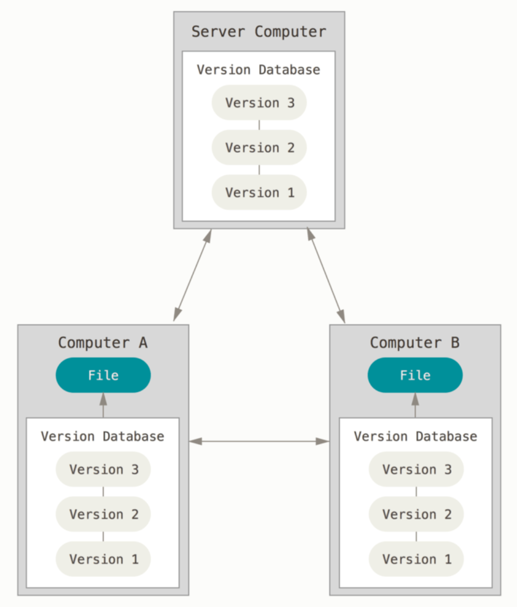

# Intro to Git

> [参考资料:Git-book](https://git-scm.com/book/zh/v2)

## 前言

### Git是什么

简而言之：Git 是目前使用最广泛的版本控制系统之一。

~~但是，这谁听得懂？~~

#### 版本是什么

版本：文件或代码的版本，例如某个项目的初步版本、最终版本。

一般的项目开发流程会涉及到项目不断的迭代（迭代是指**对文件的更新**），每一次更新文件后即产生一个新的**版本**。


#### 版本控制是什么

对项目开发过程中产生的不同版本进行**跟踪与记录**，并更够查找、回退到历史版本。

例如你对某个文件进行更新后发现自己写了一个bug,你想将文件**回退**到之前没有bug的版本，此时就需要版本控制。

### 为什么要用Git

* Git是使用广泛的**分布式**版本控制系统

#### 分布式是什么意思

分布式只多台电脑同时保存有项目的代码，换句话说，项目的代码**分布于**多台电脑之中。

#### 为什么要设计分布式的版本控制系统

项目的代码分布于多台电脑之中，这些电脑的主人可以在自己的电脑上对代码做出不同的更新，随后可以将这些不同的更新合并到同一台**主电脑**上，每个工作人员可以通过主电脑获取其他人更新后的代码。分布式的目的是**分工协作**。




### Tips

> 这是一些使用命令行或者Git的小技巧

#### 查看帮助文档

你以为我会让你用```man```查看文档？~~什么年代了还在看传统文档。~~

* **Too Long, Don't Read**：```tldr```命令

#### AI辅助工具

* Github Copilot

* Github Copilot CLI

#### modern unix

> [链接](https://github.com/ibraheemdev/modern-unix.git)

* Git 相关：```delta```
  * A viewer for ```git``` and ```diff``` output

## 安装

### 窗户系统

从网上下载Git软件包，安装到电脑上，**并设置环境变量中的PATH变量**（设置路径）。

#### 环境变量是什么

> 当场讲


### ~~高贵的~~Linux系统

用相应系统的安装包管理器进行安装。

* ~~高贵的~~Archlinux：```pacman```
* Ubuntu：```apt```

用Linux系统的安装包管理器进行安装一般不需要设置环境变量。（为什么？）

## 基本概念

### 工作区(working directory)

工作区是你在本地存放项目代码的**📁文件夹**（directory：目录、文件夹）。你将在这里修改或者更新你的代码。

使用```git init```在当前目录下创建并初始化一个git工作区。```git init```指令将会在当前目录下创建一个```.git```文件夹，其中记录了有关版本控制的信息。

### 暂存区(stage area)

暂时存放代码的地方。注意，暂存区更多是一个**逻辑上的概念**，在Git中仅作为一个过度的区域。例如当你更新了一部分的代码，但是又不想把代码作为一个新的版本进行提交的时候，可以将你修改的这部分代码先放入暂存区。

当你修改了```file.txt```文件中的某些代码后，可以使用```git add file.txt```将修改后的```file.txt```放入暂存区。

### 本地仓库(local repository)

当你确认自己已经完成了所需要进行的代码更新后，你可以将文件从暂存区**提交**到本地仓库。本地仓库是位于你自己的电脑上的仓库，**任何提交到本地仓库的代码将会被视为一个新的版本**。

### 远程仓库(remote repository)

这是一个位于**主服务器**上的仓库，当你把自己要更新的代码更新好并提交到本地仓库时，接着就可以推送到主服务器上。其他同时可以根据通过拉取主服务器上的代码获取你更新的部分代码。


#### 分支